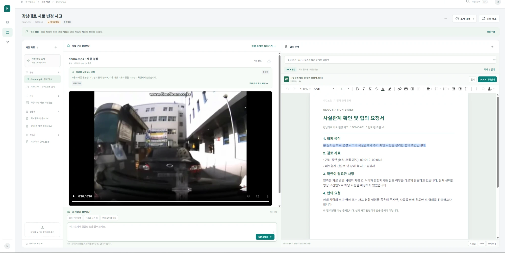
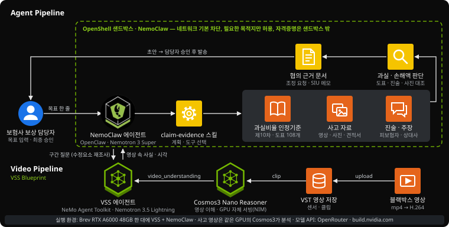
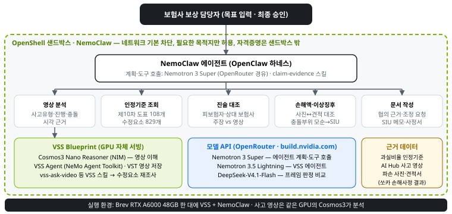

# 협의 근거 에이전트 (Claim Evidence Agent)

**교통사고가 나면 보험사 보상 담당자는 누가 몇 % 잘못했는지(과실비율)와 차 수리비를 상대 보험사·정비공장과 합의해야 합니다.**
이 에이전트는 블랙박스 영상, 과실비율 인정기준, 당사자 진술, 파손 사진과 견적서를 스스로 조사해 합의에 쓸 **근거 묶음 초안**을 만들고, **담당자가 승인한 뒤에만** 밖으로 내보냅니다.

NVIDIA Agentic AI Hackathon 출품작 · 팀 종지 · 소개서 PDF: [docs/submission/NVIDIA 해커톤_종지_협의 근거 에이전트.pdf](<docs/submission/NVIDIA 해커톤_종지_협의 근거 에이전트.pdf>)



## 문제

- 과실비율 합의가 안 되면 보험사는 손해보험협회 **과실비율분쟁심의위원회**에 심의를 청구합니다. **2024년 약 15.7만 건**(2019년 10.2만 건에서 연 8.9% 증가)이고, 소심의만 평균 **61일**이 걸립니다.
- 보험연구원 연구는 분쟁의 원인으로 **사실관계 확인의 어려움**, 담당자마다 다른 **가감 사유(수정요소) 적용**, 과실에 대한 **근거 설명 부족**을 꼽습니다. 같은 사고에도 다른 과실이 나오면 상대가 받아들이지 않습니다.
- 심의 결정의 95%(2018)가 그대로 받아들여질 만큼 결론은 인정기준으로 예측됩니다. 비어 있는 것은 **상대가 받아들일 근거**입니다.

이 에이전트는 영상의 시각으로 사실관계를 고정하고, 인정기준 도표와 가감 사유를 같은 방식으로 적용해, 근거를 문서로 남깁니다. 출처와 한계는 [docs/ROI_EVIDENCE.md](docs/ROI_EVIDENCE.md) 8절.

## 실제 실행 한 건 (사고 C006)

담당자가 목표 한 줄을 주면 NemoClaw 샌드박스 안의 에이전트가 조사 순서를 스스로 정합니다.

> "사건 C006: 이 건 상대 보험사와 정비공장에 보낼 협의 근거를 만들어줘. claim-evidence 스킬 절차를 따르고, 영상은 VSS로 확인해줘."

| 시각 | 에이전트가 한 일 |
|---|---|
| 0:02 | 스킬 절차 읽기(`skills/claim-evidence/SKILL.md`) |
| 0:04 | 사고 건 자료 조회(`agent.cli case C006`) |
| 0:20 | VSS에 영상 전체 설명 요청(`vss vlm run`) |
| 0:32 | 사고유형 후보 비교 → 인정기준 **차43-2** 「후행 직진 대 선행 진로변경」 선택 |
| 0:44 | 견적 검증 |
| 2:54 | **가감 사유 재조사**: "0~3초에 앞차가 방향지시등을 켰나?" 등 VSS에 구간 질문 4회 |
| 3:24 | 이상징후 점검 → 충돌 부위와 사진 불일치 표시 |
| 7:45 | 협의 문서 작성 도구가 인자 오류 2회 → 스키마를 읽고 스스로 고쳐 성공 |
| 8:29 | 협의 문서·사정서 생성, 담당자에게 보고 |

- 도구 호출 26회, VSS 영상 질문 6회, 중간 사람 개입 0회. 5:38~7:45 공백은 모델 API 요청 한도 대기입니다.
- 협의 문서에는 도표 인용, 가감 사유별 영상 확인 결과와 **근거 시각**(예: "진로변경 신호불이행 +10, 영상에서 확인, 0–5초 방향지시등 미점등"), 상대 주장 검토, 분쟁심의 가능성이 들어갑니다.
- 한계: 이 건의 당사자 역할 판단은 확신도가 낮은 검수 라벨과 달라 사람이 다시 확인하고 있습니다. 영상 판정 정확도는 아직 소표본 시험만 했습니다.

## 아키텍처



**NVIDIA 스택 구성** — 담당자 → NemoClaw 에이전트 → 도구 5종 → 모델·데이터 계층



| 구성요소 | 이 프로젝트에서 한 일 | 근거 |
|---|---|---|
| **NemoClaw · OpenClaw** | 에이전트 하네스. 스킬을 읽고 도구 호출 순서를 스스로 정함 | `scripts/brev/02_connect_nemoclaw_vss.sh` |
| **OpenShell** | 샌드박스. 네트워크 기본 차단 후 필요한 목적지만 허용, API 키는 샌드박스 밖 제공자에 보관 | `scripts/brev/04_use_openrouter.sh` |
| **VSS Blueprint** | 영상 저장(VST)과 영상 질의응답 에이전트(NeMo Agent Toolkit 기반, Phoenix 추적) | `scripts/brev/01_deploy_vss.sh` |
| **Cosmos3 Nano Reasoner** (NIM) | 블랙박스 영상 이해. GPU에서 직접 서빙 | `scripts/brev/vss_ask_clip.sh` |
| **Nemotron 3 Super · 3.5 Lightning** | 에이전트의 계획·도구 호출(3 Super), VSS 에이전트의 LLM(3.5 Lightning). build.nvidia.com 무료 API 과부하로 OpenRouter 경유 | `scripts/brev/04_use_openrouter.sh` |
| **vss-ask-video 스킬** | NVIDIA 공식 스킬. 가감 사유마다 영상 구간 질문 | 샌드박스 스킬 목록 |
| **claim-evidence 스킬** (직접 작성) | 도메인 절차와 도구 8종 | [`skills/claim-evidence/SKILL.md`](skills/claim-evidence/SKILL.md), [`agent/cli.py`](agent/cli.py) |

### 에이전트 도구 (`python -m agent.cli <명령>`)

| 명령 | 하는 일 | 코드 |
|---|---|---|
| `cases`, `case <id>` | 사고 건 목록, 영상 센서·사진 부위·견적 항목·양측 진술 | `agent/cases.py` |
| `candidates --place <장소>` | 장소별 사고유형 후보(영문 설명) | `agent/tools/fault.py` |
| `fault <code>` | 인정기준 제10차 도표, 현행 기본과실, 도표의 가감 사유 | `agent/tools/fault.py`, `data/reference/code_to_chart.csv` |
| `compare <id> --code N --role A\|B` | 피보험자 진술·상대 보험사 주장 대조 → 일치 / 영상과 다름 / 영상 확인 필요 | `agent/tools/statements.py` |
| `estimate <id>` | 사진에 없는 부위의 견적 항목 | `agent/tools/damage.py` |
| `anomaly <id> --code N --role A\|B` | 사고유형과 파손 부위의 모순(SIU 신호) | `agent/tools/anomaly.py` |
| `letter <id> ... --evidence ... --modifier-check JSON` | 협의 근거 문서와 사정서 작성(`outputs/<id>/`) | `agent/tools/negotiation.py`, `agent/tools/report.py` |

설계 전체는 [docs/ARCHITECTURE.md](docs/ARCHITECTURE.md).

## 데이터와 검증

| 항목 | 내용 |
|---|---|
| 사고 영상 | AI Hub 교통사고 영상(597) 평가 영상 150건을 사람이 한 건씩 검수해 라벨이 맞는 **92건**만 사용([docs/LABEL_REVIEW.md](docs/LABEL_REVIEW.md)). 라벨 오류(앞차 후진을 추돌로 표기 등)와 역할반전을 찾아 뺌 |
| 인정기준 | 손해보험협회 과실비율 인정기준(제10차 개정)의 차대차 도표 108개와 수정요소 829개를 추출. AI Hub 사고유형 84개를 도표 65개에 대응시켜 기본과실 **79/84 재현**, 개정으로 바뀐 6건은 현행 기준으로 수정 |
| 수리비 정답 | 쏘카 견적서의 실제 손해사정 전·후 금액(조정 11,425건) |
| 합성 사고 건 | 영상 + 사진 + 견적 + 진술 92건(정상 56, 과잉 견적 18, 모순 18) |
| 재현성 | 모든 생성은 `SEED=42`. 원본을 파서 없이 다시 읽어 대조하는 감사 스크립트(`scripts/audit_eval_sets.py`) |

**원본 데이터는 저장소에 없습니다**(AI Hub 재배포 제한 가능성). 파일 키 목록과 다운로드·재생성 스크립트만 있습니다.

## 재현

### 1. 데이터 (이 PC, GPU 불필요)

```bash
cp .env.example .env            # AIHUB_APIKEY 입력 (AI Hub 데이터 승인 필요)
python scripts/download_aihub.py --stage 1 meta 2 3
python scripts/build_interim.py
python scripts/build_eval_fault.py
python scripts/build_eval_reviewed.py
python scripts/download_knia.py
python scripts/build_chart_map.py
python scripts/build_synth_cases.py
python scripts/build_statements.py
python scripts/extract_media.py
python scripts/audit_eval_sets.py
python eval/run_eval.py --backend oracle   # 정답 주입 상한(모델 성능 아님)
python -m agent.cli case C006              # 도구 동작 확인
```

### 2. GPU 인스턴스: VSS + NemoClaw + 스킬

RTX A6000 48GB 한 대에서 확인했습니다. 순서와 막힌 점 14개의 대응은 [scripts/brev/README.md](scripts/brev/README.md).

```bash
bash scripts/brev/00_prereqs.sh
bash scripts/brev/01_deploy_vss.sh
bash scripts/brev/02_connect_nemoclaw_vss.sh
bash scripts/brev/03_install_claim_skill.sh demo
bash scripts/brev/04_use_openrouter.sh demo
```

### 3. 에이전트 실행

```bash
openshell sandbox exec --name demo -- openclaw agent --agent main --session-id c006 \
  --message "사건 C006: 이 건 상대 보험사와 정비공장에 보낼 협의 근거를 만들어줘. claim-evidence 스킬 절차를 따르고, 영상은 VSS로 확인해줘."
```

OpenClaw 대시보드 주소는 `nemoclaw demo dashboard-url --quiet`로 얻고, SSH 터널로 18789 포트를 엽니다.

## 현재 상태와 한계

- 동작 확인: 목표 한 줄에서 협의 문서까지 에이전트 완주(C006), VSS 구간 재질문으로 가감 사유 확인, 인정기준 도표 인용, 진술 대조, 견적 검증, SIU 라우팅.
- 한계: 영상 모델의 사고유형·당사자 역할 판정 정확도는 소표본만 시험했고 92건 측정 전입니다. 가감 사유 판단은 공개 정답이 없어 "영상 확인 필요" 분류까지만 평가합니다.
- 과실 판정은 "초안 + 근거 + 사람 승인"을 원칙으로 합니다. 이 에이전트는 과실을 결정하지 않고, 어떤 문서도 스스로 보내지 않습니다.

## 저장소 구조

```
agent/          에이전트 도구(cli.py), 파이프라인, 도구 모듈(tools/)
aihub/          AI Hub 원본 파서
demo/           담당자 화면 데모 '사건노트'(정적 사이트, Workers 배포, demo/README.md)
skills/         OpenClaw 스킬 claim-evidence
scripts/        데이터 다운로드·생성·감사, brev/ GPU 인스턴스 구성
eval/           평가 실행과 지표
data/reference/ 인정기준 매핑, 충돌 부위 참조표 등 (원본 데이터는 git 제외)
data/manifests/ 파일 키·평가 세트 id 목록
docs/           설계, 검수, 조사 문서, submission/ 제출 자료
```

## 문서

| 문서 | 내용 |
|---|---|
| [docs/submission/](docs/submission/) | 제출 소개서(`report.html` → PDF)와 양식 답변 |
| [docs/HANDOFF.md](docs/HANDOFF.md) | 배경, 데이터 확인 결과, 결정 이력 전체 |
| [docs/ARCHITECTURE.md](docs/ARCHITECTURE.md) | 파이프라인과 도구 |
| [docs/DIRECTION.md](docs/DIRECTION.md) · [docs/SCOPE.md](docs/SCOPE.md) | 문제 정의, 범위, 남은 일 |
| [docs/LABEL_REVIEW.md](docs/LABEL_REVIEW.md) | 평가 영상 150건 검수 |
| [docs/ROI_EVIDENCE.md](docs/ROI_EVIDENCE.md) | 현업 조사, 통계, 분쟁 원인 연구 |
| [scripts/brev/README.md](scripts/brev/README.md) | GPU 인스턴스 구성 절차와 막힌 점 |
| [demo/README.md](demo/README.md) | 담당자 화면 데모 실행·배포 |
